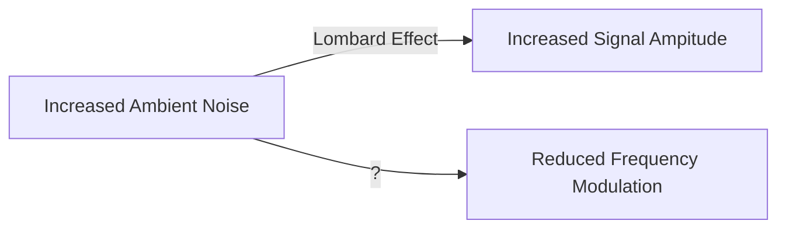

# Homework #4

## Part 1

### By Maia Austin

#### BIOL 381

##### Professor: Dr. Gotelli

###### TA: Lauren Ash

---

#### Unordered List

* *Tursiops truncatus*
* *Stenella attenuata*
* *Sotalia guianensis*
* *Sotalia fluviatilis*
* *Grampus griseus*


#### Ordered List

1. Tursiops 

   1. *T. truncatus*
   2. *T. aduncus*

2. Sotalia

   1. *S. guianensis*
   2. *S. fluviatilis*

3. Stenella

   1. *S. attenuata*

   2. *S. cleymene*

      

   

Manual Line Break  <br/>

Link to GitHub https://github.com/austinmaia. 

### One of my species of interest is the Guiana Dolphin (*Sotalia guianensis*)


>The Guiana dolphin (Sotalia guianensis), also known as the estuarine dolphin or costero, is a dolphin found in the coastal waters to the north and east of South America, and east of Central America. It is a member of the oceanic dolphin family (Delphinidae). It can live in both saltwater and freshwater
>
>-Wikipedia


```
Here's a block of plain text!
```


```{r}
#Here's a block of R code
x <- 3
y <- "The number 3"

```


Use the `plot()` function to plot a graph.


***

$y = mx + b$   

$$
y = mx +b
$$

***


| Type of Pet | Number Allowed | Pet deposit |
| :---------- | -------------- | ----------- |
| Cats        | 2              | $100        |
| Dogs        | 1              | $150        |

I prefer ==cats== as pets because they're less work, but I do like ==dogs==!





