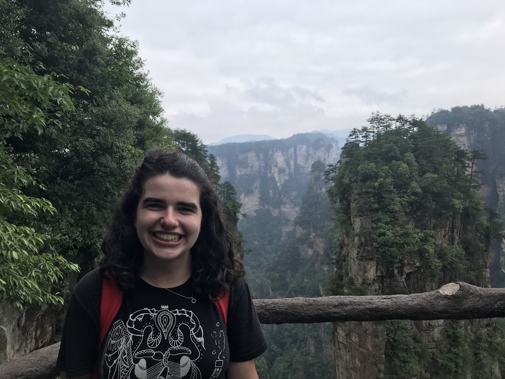

Hello! I am a first year PhD student in the Biology department. I'm excited to build up my computational and R skills in this course. (p.s. this photo is in Zhangjiajie National Park in China, which was the inspiration for the scenery of Avatar!)

## Homework Submissions

[Homework 2](HW2.html)

[Homework 3](Homework3.html)

